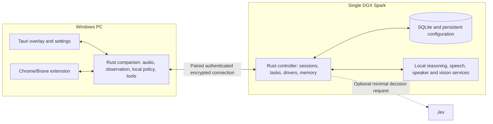

# Plan 001: Build Avesra on one Spark with a persistent Windows companion

> **Executor instructions:** This is a greenfield implementation contract. Read it in full. Establish the tests and command harness described below, execute milestones in order, and record actual results. Never replace live-device evidence with mocks. Report missing hardware, model incompatibility, inaccessible application surfaces, and unmet latency/recognition targets explicitly. Do not silently weaken the product requirements.
>
> **Drift check:** The planning baseline is remote `main` at `eb0189ff64b276b4f1e2d850ab3cff6979189ad9`. Run `git status --short`, `git rev-parse HEAD`, and `git diff --stat eb0189ff64b276b4f1e2d850ab3cff6979189ad9..HEAD`. At the baseline only `LICENSE` exists; the owner subsequently authorized publishing these plans. Inspect any newer source, instructions, or plans before proceeding; reconcile overlapping work instead of overwriting it.

## 1. Status and purpose

- Priority: P1.
- Category: product/architecture implementation.
- Effort: L; multiple separately verifiable milestones, not a one-session scaffold.
- Risk: HIGH for identity, desktop actions, and learned routines; MED for UI and driver plumbing.
- Planned at: `eb0189ff64b276b4f1e2d850ab3cff6979189ad9`, 2026-09-24.
- Repository: https://github.com/Medalink/avesra.
- Intended Windows checkout: `E:\Dev\Avesra`.
- Initial deployment: `ssh spark2` with Local Studio and one Windows desktop client; optional client GPU acceleration is in scope.
- Planning status: decisions captured; application implementation has not started. Six model packages are provisioned through Local Studio and hash checked; both reasoning recipes passed initial synthetic inference probes. See `spark2-model-setup.md` for measured results and remaining M0 gaps.

Avesra is **A Very Effective Smart Reasoning Assistant**. It continuously listens for an enrolled owner, recognizes clearly assistant-directed requests, acts through the owner's PC, speaks in a customizable voice, and learns useful context and routines. It must remain available while the user games without requiring model inference on the RTX 5090. Swapping a model or moving a lane must not require changing the task engine, UI, or permissions.

This plan covers the whole first release and its foundations. M3/M4 are the first useful voice-to-action checkpoint; they are not completion of the whole product.

**Owner-defined done:** The three real voice-to-PC outcomes in section 3 are mandatory sign-off tests. They are the primary product proof. Internal milestones and technical test results support those outcomes; they cannot replace them. Do not announce completion until Avesra itself performs those workflows through its shipped controller and drivers on the actual PC/Spark.

## 2. Current state and evidence

The remote root was inspected using GitHub CLI. It contains an MIT `LICENSE` and no source, package manifests, instructions, build scripts, tests, or design files. Consequently there are no existing source excerpts or verification commands to copy. Commands later in this document are **proposed contracts for M1 to implement**, not commands that already exist or have passed.

The local `E:\Dev\Avesra` path was created for these planning documents, then initialized as a checkout of the existing `Medalink/avesra` repository when the owner requested publication. Its initial tracked content was the original `LICENSE`; the scoped addition is `plans/`. No application source has been implemented. Inspect the current checkout before starting implementation and preserve any later work.

The surrounding assistant session was in `E:\Dev\Laravel\iris`, which has unrelated work. Avesra is a separate product. Do not edit Iris, copy its Laravel stack, or import its repository-specific policies as Avesra architecture.

The user's PC has an RTX 5090 and the user owns two Sparks. The owner subsequently selected `ssh spark2`; discovery on 2026-09-24 verified hostname `spark-c8bb`, Ubuntu 24.04.5 LTS/aarch64, NVIDIA GB10 with driver 580.178.04, approximately 121 GiB RAM and 3.3 TiB free disk. Local Studio is running on port 8080 with API authentication. Its installed source is revision `d1abdef` with pre-existing local patches, which must be preserved. Initial `/status` reported no inference process and `/recipes` was empty. Existing ComfyUI and a Qwen3.8-Flash-Next supervisor are separate workloads; do not reset or take ownership of them. The earlier timeout concerned a different `spark` alias, not this verified target. The second Spark remains outside initial scope.

Read-only PC GPU discovery on the same date reported NVIDIA GeForce RTX 5090, 32,607 MiB total VRAM and driver 616.92. A single observation showed 3,943 MiB used and 14% utilization; these are transient readings, not reserved capacity or an inference benchmark. The downloaded Spark FP8 reasoning models must not be assumed to fit this card alongside desktop/game workloads. Start client acceleration evaluation with smaller audio/identity lanes or a separately qualified compact model.

## 3. Confirmed product decisions

| Topic | Contract |
| --- | --- |
| Name | Avesra; use the name throughout UI, binaries, documentation, and repository paths. |
| Compute | One Spark initially, with optional capability-checked client GPU inference to reduce measured latency. Spark-only operation remains required; gaming must release client inference allocations. |
| Model management | Use Local Studio on Spark2 for supported downloads and reasoning/vision recipes/lifecycle. The owner selected dedicated local speech/speaker drivers alongside it; every lane remains swappable through Avesra. Do not introduce another generic model manager. |
| Optimization | Instrument every pipeline stage and compare latency, resources, and correctness on repeatable workloads. No optimization bypasses identity, intent, authorization, or outcome verification. |
| Driver design | Separate logical lanes, adapters, concrete deployments, resource profiles, and tool integrations. |
| Default listening | Continuous after enrollment, with no mandatory wake word. Explicit mute/deafen/pause overrides remain authoritative. |
| Request intent | Accept clearly assistant-directed requests, allow short follow-ups, ignore ambiguous conversation. Recognized speech alone is insufficient. |
| Identity | One authoritative owner; additional enrolled users have explicit owner-managed permissions. |
| Observation | Both continuous screen awareness/learning and explicit watch-and-learn demonstrations. |
| Routine actions | Perform requested routine actions immediately within existing grants. |
| Consequential actions | Ask before send/publish, delete, spend, or permission changes. |
| PC fixes | Run diagnostics automatically; show a concrete proposed fix and ask before changing system/network configuration. |
| Browser | Chrome and Brave; use websites rather than initial service-specific Gmail/X API integrations. |
| App control | Resolve apps by name, learn the correct mapping, find inputs, and reuse previously successful workflows. |
| Coding apps | Open the selected Claude/Codex app and project, compose/type a prompt. Use terminal surfaces only when specified. No direct model API handoff or delegated coding agents. |
| Prompt submission | Submit only when the user explicitly asks to start/run; otherwise leave the prompt ready for review. |
| Retention | Useful memories plus accepted conversation/task history indefinitely, until deletion; raw microphone audio/screenshots are transient. |
| Background communication | No unsolicited spoken advice. Notify on requested task completion, failure, or need for input. Small learning/action chimes are allowed. |
| Chime follow-ups | Answer "What did you learn?" / "What did you just do?" with the actual event behind the sound. |
| Cloud AI | Avesra's inference stays local except optional Jev. Application typing does not become an assistant-side cloud model integration. |
| Lights | Defer the specific integration until after voice and PC/browser control. |

The Rust/Tauri/Svelte design below is the advisor's implementation recommendation, consistent with the requested Rust discussion and the approved Tailwind mockups in `design/`. Model selections and performance budgets are candidates to validate, not owner-supplied facts or measured promises.

### Initial workflows

1. Open any installed application by its learned name/alias; clarify ambiguous matches once and remember the choice.
2. Open Claude/Codex for a named project, such as Iris, and type a request based on the owner's description. Do not modify that project's source directly as part of this workflow. Do not invent requirements when expanding a prompt.
3. Open Gmail in the chosen browser and inspect the requested number of latest messages in the intended mailbox, including the owner's final acceptance request for **10 emails and package-delivery evidence**. Resolve multiple accounts or an ambiguous meaning of latest before reading the wrong mailbox.
4. Visit X in the chosen browser and report current AI trends, with links/timestamps and the actual view/search used. Opening an installed X app is also handled by app discovery; "X" as a placeholder for any application is not a fixed product identifier.
5. Connect the configured work VPN using its installed client. Cisco was given as an example; the exact product/version/MFA flow must be identified in M0.
6. Raise/lower/set Windows output volume, with a configurable step for unspecified relative commands and observed final level.
7. Investigate "Why is my download slow?" and other PC issues using settings and bounded diagnostic commands, explain evidence, propose fixes, and apply only approved configuration changes.
8. Learn how the user opened an application or completed a routine, recall it on a later request, and explain what was learned when asked.

### Owner-defined end-to-end sign-off scenarios

Run these through real microphone input, owner recognition, local planning, the shipped PC/browser drivers, and observed postconditions. Manually driving the app, using a development-only shortcut, typing the result through the acceptance runner, or replacing the real model with a fixture does not pass.

| Scenario | Spoken request and required result | Evidence / unacceptable substitutes |
| --- | --- | --- |
| OW1 — Claude/IRIS | "Open Claude for the IRIS project and type 123 into a new chat." Resolve the actual Claude app and IRIS project, create a fresh chat, and put exactly `123` in its prompt field. Leave it unsubmitted because this request does not say start/run. | Observe correct app/project, new-chat state and exact draft text. Launching the app alone, reusing an old chat, adding extra prose, typing in another input, or submitting are failures. |
| OW2 — package email | "Check my latest 10 emails and see if I got my package delivered." Inspect the 10 newest messages in the configured mailbox and explain whether a relevant delivery confirmation was found, with sender/date/subject or equivalent source reference. | Count actual messages, not assumed Gmail thread rows. Distinguish delivered from shipped/out-for-delivery/estimated arrival. If no confirmation, fewer messages, or several candidate packages exist, report the actual evidence/ambiguity. Do not invent physical delivery or follow a tracking link unless needed and authorized. |
| OW3 — ready to post | "Open X so I can post about my new app." Open/focus X in the configured Chrome/Brave profile, verify the intended account/site is ready for the owner to write a post, and report readiness. | Opening a browser without reaching the site is insufficient. Do not generate, submit or publish a post from this request. If login/CAPTCHA is needed, the user may complete it and Avesra resumes verification; a pending challenge is not completed readiness. |

For OW2, the proposed default is the selected account's Inbox, including read and unread messages, excluding Spam/Trash unless requested. Make that mailbox scope visible/configurable during setup so the voice command does not require repeated clarification. Gmail's conversation grouping may require inspecting messages inside threads; do not silently reinterpret 10 messages as 10 conversations.

Validate OW2 deterministically on fixture mailboxes with delivered, shipped-only, out-for-delivery, no-match and multiple-package cases, then on the owner's real mailbox. A truthful "no delivery confirmation in these ten" can be correct; claiming an expected delivery where no real message supports it cannot. Model inference must remain local while reviewing message content.

The `owner-workflows` live suite is a release requirement and must record actual device/model/app versions, recognized requests, action/step IDs, and observed postconditions. Use redacted evidence; do not publish private email content or project context in the repository. Report each scenario separately as PASS/FAIL/BLOCKED. The owner reviews the actual visible result and spoken answer.

### Explicit non-goals for the first release

- No universal claim that every website or desktop app is supported. A general control mechanism plus real acceptance for the initial workflows is required; inaccessible/new surfaces have honest outcomes.
- No always-elevated agent, UAC bypass, game injection, game input automation, or anti-cheat workaround.
- No invisible email/post sending, autonomous code changes through external agents, or automatic AI API fallback.
- No raw screen/audio archive, general keylogger, ambient unknown-speaker transcript archive, or training from captured credentials.
- No multi-Spark sharding, 5090 inference, new Home Assistant installation, mobile companion, remote Internet control, or plugin marketplace in this release.

## 4. Architecture and ownership



### Windows companion

- Tauri 2 with bundled Svelte/TypeScript/Tailwind assets; no remote web content in the privileged settings webview.
- Rust owns microphone capture, output playback, local stop/mute controls, Windows app discovery, UI Automation, capture, and action execution. UI animations do not own the audio loop.
- Use a user-session process, not an interactive Windows service in session zero. Start at sign-in only after setup enables it. Minimizing or closing the overlay hides it to tray; explicit Quit stops capture and the client process.
- Use Windows Core Audio for master output control. Use structured native/UI Automation controls first, visual grounding second. Use a browser extension for signed-in browser pages.
- Only the local executor owns desktop input. Background jobs must not compete for the mouse, keyboard, focus, or browser tab.
- In the `single-spark` profile, do not load inference models on the PC. In an explicitly enabled `accelerated` profile, eligible lanes may use the client GPU within measured VRAM, utilization, and frame-time budgets. CPU-only clients remain supported. Ordinary audio DSP and desktop rendering are accounted for separately.

### Spark controller

- Rust/Tokio service for session state, task transitions, policy checks, lane routing, queues, model health, memory, and resource profiles.
- SQLite is the initial durable source of truth. One controller process owns writes; inference workers do not edit memory or task state directly.
- Local Studio owns supported model downloads, reasoning/vision recipes, serving engines, and their lifecycle. The Avesra adapter references its recipe/deployment IDs and negotiates capabilities. The installed version's supported launch engines are vLLM, SGLang, and exllamav3; an audio proxy route does not prove it can host every speech/speaker model. The owner explicitly chose dedicated local ASR/TTS/speaker services alongside Local Studio. Avesra's deployment supervisor owns those narrowly scoped service lifecycles and exposes the same lane contracts, health, cancellation and metrics. They may read the pinned downloaded artifacts; they do not modify Local Studio internals or compete for ownership of its reasoning engines. Until serving capability is proven, downloaded packages remain unavailable deployments.
- Use pinned model revisions and runtime images, preserving Local Studio's existing authentication. Avesra owns its controller and dedicated speech/speaker service supervision, not Local Studio's internal processes. Give each service an explicit memory/compute budget and independent readiness probe. Verify actual port exposure; protect any LAN-reachable inference port with authentication. Do not assume a Docker-published port is loopback-only.
- Foreground speech and command work take priority over passive observation, routine extraction, and indexing. Background queues are bounded and coalesce stale screen changes.

### Transport

Use TLS WebSocket connections for the initial PC/controller protocol: a control/event connection plus separate bounded media streams. Use explicit versioned serde message envelopes; do not send untyped model output straight to an executor. M1 must freeze and test the schema before UI integration.

Pair with a one-time code and verified server fingerprint on a local setup screen. Persist a revocable per-device credential; never expose an unauthenticated LAN command server. Scope browser native messaging to the installed extension ID and authenticated user-session host. Redact credentials from logs and diagnostics.

Every message carries protocol version, device/session identity, request ID, sequence, and the relevant capture/action epoch. Tool requests additionally carry task/step ID, expiry, target identity, policy grant, and approval identity where required. Authenticate peers before accepting media or actions. Unknown versions, out-of-order frames, invalid grants, expired requests, and stale epochs must fail explicitly.

Bound message/frame sizes, media duration, queues, and connection retries. Document codec/sample-rate negotiation and reject unsupported formats. Avoid routing screenshots/audio through the overlay's DOM event system. Support clean cancellation without relying on a network round trip for local mute/stop.

## 5. Driver, deployment, and profile contracts

### Separate concepts

- **Lane:** a capability the controller needs.
- **Driver:** an adapter to a provider/runtime or tool surface.
- **Deployment:** a driver instance with model, address, machine, limits, and artifact revision.
- **Profile:** lane assignments, resource budgets, priorities, and explicit fallback order.

A model may serve multiple lanes. A lane may have multiple compatible deployments. Do not load one model copy per lane when those assignments refer to the same deployment.

Use Rust traits internally and versioned service contracts at process boundaries. Register built-in adapters explicitly. Adding a new adapter may require a build; changing model/deployment configuration should not. Do not build a dynamic Rust-library ABI/plugin loader in this release.

### Lane interfaces

| Lane | Input | Required output/capabilities |
| --- | --- | --- |
| Speech activity / transcription | Sequenced audio chunks and language/settings | Speech boundaries, partial/final text, timing, cancellation; partials cannot authorize actions |
| Speaker identity | Audio segments + enrolled profile revision | Candidate identity or unknown, similarity/evidence quality, overlap/insufficient-speech outcome; never a permission grant |
| Conversation/planning | Bounded context, accepted request, offered tool schemas | Response deltas and typed action proposals; reasoning/internal tokens stay out of speech |
| Screen understanding | Scoped fresh image/UI observations and question | Observations/targets tied to observation ID, coordinate space and capture time |
| Speech generation | Approved speakable text and versioned voice preset | Audio chunks, format, cancellation, playback completion signals |
| Decision evaluation | Narrow state and typed question schema | Validated choices/scores with source/model metadata; no direct actions |
| Memory processing | Accepted task events and permitted observations | Proposed summaries, facts, mappings, routine candidates with sources; controller validates writes |

Each driver advertises capabilities, supported formats, model/revision, stream support, cancellation behavior, context/input limits, health, and deployment locality. Optional capabilities are negotiated; reject a profile assigning a text-only model to image interpretation or a nonstreaming service to a required streaming contract.

Health distinguishes configured, starting, loading, ready, degraded, unavailable, and incompatible. A responding HTTP port is not proof that the required model is ready. Validate with an actual capability probe.

### Initial inference candidates

| Purpose | Candidate to benchmark | Selection gate |
| --- | --- | --- |
| Main reasoning + vision | Compare official Qwen3.6-35B-A3B-FP8 and Qwen3.8-27B-FP8 recipes in Local Studio; do not declare a winner before local measurements | Tool correctness, real UI grounding, short-response latency under speech load |
| Streaming English ASR | NVIDIA Nemotron Speech Streaming English 0.6B | Speech accuracy and endpoint latency on the owner's microphone, including project/app names |
| Speaker matching | SpeechBrain ECAPA-TDNN baseline; optionally a local pyannote component for overlap/diarization | Owner/unknown separation, short speech, noise and replay limitations; no vendor benchmark substituted for local evaluation |
| Voice | Qwen3-TTS, testing 0.6B and 1.7B runtime variants | Consistent chosen voice, chunked playback latency, intelligibility and interruption |
| Hard visual actions | UI-TARS-1.5-7B only if the main vision model cannot meet grounding tests | Measurable improvement that justifies extra resident resources |
| Routing/evaluation | Local main model; optional Jev adapter | Typed-result validation and explicit cloud boundary |

These are replaceable starting points, not a requirement to run all simultaneously. Generate a designed voice during setup, then reuse its preset rather than running the voice designer on every utterance. Store an explicitly selected generated voice asset as a configuration artifact; this is distinct from retaining microphone recordings. Do not assume a voice preset or speaker embedding works with another model revision.

M0/M3 must pin actual working ARM64/GB10-compatible container digests, dependency versions, model revisions, quantization, license/terms, context limits, and measured working sets. Public model documentation does not prove a particular serving image runs on the user's Spark. Avoid floating `latest` tags in the accepted deployment.

### Resource and switching policy

- Ship `single-spark`, optional `accelerated`, and `gaming` profiles. `single-spark` is the baseline and uses no client inference. `accelerated` may place ASR, TTS, speaker matching, or a suitably sized vision/reasoning model on a qualified client GPU only when end-to-end measurements justify it. `gaming` drains/cancels client inference at safe boundaries, frees model allocations, and uses Spark deployments. Future device slots cannot masquerade as ready hardware.
- Start with a modest measured context/concurrency budget; never allocate essentially all unified memory to the LLM cache while speech services also need memory.
- Reserve headroom for the OS/controller and overlapping ASR/TTS. Establish numeric reservations from M0 measurements; queue or reject excess work explicitly.
- Priority: local mute/stop control, interactive audio and accepted commands, active action verification, passive observation, memory consolidation.
- Model/profile changes: validate, load/probe replacement where capacity permits, switch new requests at turn/utterance boundaries, drain/cancel old requests, then unload unused models. If Local Studio requires unloading the active model first, disclose the interruption, preserve its recipe, and reload it on replacement failure; do not promise a zero-downtime swap. Show pending/failed changes. Never replay an uncertain desktop action during a route change.
- Keep interactive speech and the normal command model warm within their resource budget; do not unload/reload models for every utterance. Cache verified app aliases and semantic routines, while checking current target/focus before action. Run independent ASR and speaker analysis concurrently; speculative work cannot authorize an effect before final acceptance.
- Avoid requiring a long generated plan for every familiar command. A recognized, unambiguous accepted request may select a validated typed native action or learned routine with bound arguments; unresolved requests use the planning lane. This fast path still requires the same speaker/intent gates, grants, focus/freshness checks, approvals and observed outcome. Measure exact argument accuracy and ambiguity rejection before enabling it. Keep tool schemas/proposals concise; generation throughput alone does not describe time until an executable proposal is complete.
- Client placement requires device capability and model-footprint checks, bounded queue age, live free-VRAM/utilization/thermal signals, and measured LAN transfer cost. Use hysteresis and a minimum dwell time to prevent routing oscillation. A manual Gaming toggle overrides automatic detection. Background learning yields first; reserve capacity for cancellation and interactive speech.
- On memory pressure, defer background jobs and optional specialists before destabilizing interactive speech. Use only fallback placements enabled in the selected profile; never silently use cloud AI or a client GPU excluded by that profile. Profile transitions must not silently downgrade the owner/intent acceptance thresholds.
- Service outages produce a visible degraded state. When the controller is unreachable, local controls still work and the PC does not execute old queued model actions after reconnect.

## 6. Identity, listening, and request acceptance

### Enrollment and users

The first authenticated local setup creates the single owner. Capture several short prompted phrases plus natural speech, check input quality, and verify using held-out speech. Approximately one minute is a UX starting point, not a recognition guarantee. Tune enrollment requirements based on measured quality.

Keep raw enrollment audio in memory only and discard it after extracting the versioned profile. Persist derived speaker representations with model/revision and enrollment-quality metadata. A speaker-model change requiring incompatible embeddings initiates re-enrollment; do not silently accept the old vectors. Protect derived profiles as sensitive local data; exclude them from generic logs, cloud requests, and normal diagnostic exports.

Additional users enroll explicitly. They have no action or owner-memory access until the owner grants scopes. The owner controls enrollment, grants, revocation, and ownership transfer through an authenticated local management flow. A voice match alone cannot change ownership or expand permissions. Use OS-backed local authentication or an owner credential protected with Windows facilities; verify the selected method in M0. Never store a plaintext owner password.

Do not auto-enroll unfamiliar voices or silently update biometric profiles from ambient speech. Continuous learning refers to routines/preferences/context, not unattended biometric retraining.

### Acceptance pipeline

1. Capture local audio only when the current local mode permits it; label frames with a capture epoch.
2. Detect speech and process speaker/ASR in bounded local services. Speculative transcription is allowed for latency but remains transient until accepted.
3. Reject/abstain on unknown speakers, insufficient signal, ambiguous match, overlapping speech, or stale epochs. Speaker diarization alone is not identity verification.
4. Verify that the enrolled speaker has applicable rights and that the utterance is clearly directed at Avesra. Owner speech to teammates must not trigger commands.
5. Resolve references using the active conversation and current screen, without accepting another speaker merely because the previous speaker was the owner.
6. Create an accepted user turn/task only after these gates; then persist it and permit planning.
7. Independently authorize each proposed effect against task intent, actor grants, and any required approval.

Use `accept`, `reject`, and `abstain` as explicit outcomes. Do not convert an LLM's self-reported confidence or a speaker similarity into a calibrated probability without measured calibration. Short follow-ups still require speaker evidence; if "yes" is too short to establish identity, request a longer explicit reply or use a local UI confirmation.

Voice matching is not proof against recordings, synthesis, illness, microphone changes, or similar voices. Test and report these limits. Use replay/echo suppression where supported, but keep ownership/permission changes and high-impact confirmations anchored to the authenticated local UI. The first release must not claim secure voice-only authentication.

### Listening and interruption modes

| Control/state | Mandatory behavior |
| --- | --- |
| Mic mute | Stop local capture immediately, clear unsent buffers, invalidate incomplete/unaccepted turns. Already accepted tasks may continue. |
| Deafen | Mic mute plus immediate local playback stop; suppress chimes. Restoring sound must not silently clear an explicit microphone mute. |
| Stop task | Cancel queued steps and owned cancellable processes; show any already-completed or uncertain effect. Do not imply rollback. |
| Pause assistant | Stop capture/observation and admission of new actions. Suspend remaining task steps at a safe boundary; show noninterruptible work still in progress. |
| Minimize/close overlay | Hide to tray without changing listening/action mode; stop hidden animation work. |
| Quit | Stop capture, playback, and client activity; cancel/invalidate pending local work and inform the controller when possible. |
| Windows lock/sign-out | Stop local capture/observation and desktop actions. Require a fresh authenticated connection/session before resumed execution. |
| Network loss | Local controls remain effective; no delayed stale actions on reconnect; unknown-effect steps enter reconciliation. |

Local mute/stop is authoritative even if the Spark is blocked. On reconnect perform an epoch/mode handshake before accepting new actions. If a request crossed the acceptance boundary just before muting, it is an accepted task and remains visible/cancellable; if it was incomplete, it must never be resurrected from a late transcript.

Allow the owner to interrupt speaking. Stop local output first, cancel upstream TTS where supported, and discard late audio chunks using utterance IDs/epochs. Prevent the assistant's own voice and desktop playback from creating commands with playback-reference echo handling and explicit output provenance; an implementation that simply cannot listen while speaking must be reported as a degraded mode, not full interruption support.

## 7. Desktop interface and onboarding

Implement a small borderless, draggable, optional always-on-top overlay with a system-tray entry, following the approved mockups in `design/` (see `design/README.md`). Visual direction: dark only, neutral grey surfaces (`#121214` to `#26262a`), square corners, Geist and Geist Mono, a Ruby accent (`#E0115F`; filled controls `#960B3F` for readable white text), and accessible contrast. Reserve amber for input-off, unavailable and degraded states and red for stop, error and disconnected. This is Avesra's standalone design, not an Iris screen. Keep the interface compact; technical details belong in settings. Respect reduced motion and mixed-DPI/multi-monitor coordinates.

The compact overlay is transparent and built around one live signal bar driven by real microphone/playback levels and lane events, with three distinct renderings: human audio as a filled mirrored waveform colored by transient source classification (owner blue `#3A5DD8`, other people green `#8EDE4A`, background grey); thinking as a gamma-style trace fused with stepped digital activity; and Avesra's speech as a ribbon of synthetic strands, red to Ruby. Working, muted/deafened, paused, and disconnected use their own flat indicators. Source coloring is a live display only: it creates no retained record of unknown speakers and is neither an identity decision nor a permission. Provide a non-WebGL fallback and a static reduced-motion frame, and stop rendering while hidden.

Distinguish passive listening, recognizing, accepted request, thinking, speaking, working, muted, paused, and disconnected, including for screen readers. Passive, recognizing, accepted, thinking, and speaking show no visible text; working, muted, deafened, paused, and disconnected show a short label. Mic/deafen/settings/minimize controls appear on hover or keyboard focus, or while switched on; Stop remains visible while a task is active. Do not beep for every unknown speaker or fabricate numeric identity certainty.

Expansion shows the current request, concise streaming response, active task/progress, and recent meaningful events. It is not a required full chat dashboard. Clicking a learning/action event opens its short explanation and source. A local text input is useful when muted or recognition needs recovery.

Settings sections:

1. Audio and voice: devices, test meters, voice preview/designer, pace/volume, optional wake phrase/push-to-talk, hotkeys, chime toggles/volume.
2. Models and drivers: per-lane adapter/model/deployment, actual readiness, probe, limits, locality, compatibility, pending changes.
3. Profiles and machines: working single-Spark profile, resource budgets, future slots clearly unconfigured, pairing and revocation.
4. People and voice identity: owner, enrollment/re-enrollment, additional users and grants, profile deletion.
5. Observation and actions: monitored displays/apps, exclusions, learned app aliases, routine inspection, pending approvals, pause controls.
6. Memory and diagnostics: retained history, editable facts/routines, source/date, deletion/export, latency/health, failures and redacted support bundle.

Onboarding: pair the Spark; verify service capabilities; select microphone/speakers; enroll/validate the owner; select a generated voice; show listening and observation scopes; pair Chrome/Brave extension; resolve initial app aliases/projects; test a harmless volume change and rollback to the prior level. Explain transient media versus retained text/history. Setup must not falsely complete while inference services are unavailable.

## 8. Tool execution and permissions

The model proposes a typed action; the Rust controller validates it; the PC executor independently checks the grant/epoch/target before acting. A model, webpage, email, terminal output, memory, or demonstration cannot mint permissions or mark an action successful.

### Tool result contract

Return `success`, `failed`, `needs_input`, `cancelled`, `unsupported`, or `unknown_effect`, with redacted structured evidence. A successful click is not equivalent to a successful workflow. Every effect needs a postcondition or a declared uncertainty. Keep plan/proposal status separate from completed execution.

Use a persistent task/step ledger with stable step IDs, approvals bound to the exact action and target, start/finish times, and outcome. Retries may repeat reads. Mutating steps must query/reconcile before retrying; do not claim exactly-once delivery for arbitrary GUI actions. A lost acknowledgment after Submit must produce reconciliation, not another blind Submit.

Only one desktop-input lease is active at a time. Verify the target window/tab/element and observation freshness immediately before input. If the user changes focus or intervenes, stop/reobserve rather than type into the new foreground window. Routine memory stores selectors and preconditions, not unconditional pixel coordinates.

### Authorization matrix

| Operation | First-release rule |
| --- | --- |
| Launch/focus an app; navigate requested site; read requested content; adjust volume | Immediate on an accepted authorized request |
| Fill an app prompt | Immediate for the named target/project; do not clear unrelated existing content without resolving it |
| Submit Claude/Codex prompt | Only an explicit start/run request grants this particular submission |
| Read-only diagnostic catalog | Immediate within bounded duration/output and permitted target scope |
| System/network fix; generated diagnostic script outside the reviewed catalog | Present concrete commands/effects for approval before execution |
| Send/publish/delete/spend/grant | Explicit approval bound to the shown action/target; no blanket model-issued approval |
| Existing configured VPN connect | Routine requested action; pause for MFA/user authentication; changing VPN settings is a separate confirmed fix |
| Owner/user-management changes | Authenticated owner UI; voice alone insufficient |
| Replay learned routine | Reevaluate every step under current permissions and fresh state |

Do not label an arbitrary generated shell script "read-only" solely because a model says it is. The automatic diagnostic catalog uses fixed executables/cmdlets and validated typed arguments, not concatenated command strings. Proposed new scripts require review, timeout/output caps, a non-elevated default, and recorded approval. Terminal prompt typing and shell execution are distinct operations.

Use Windows UAC as intended. No always-admin companion, automated UAC consent, protected-desktop injection, security-agent disabling, or credential extraction. MFA/password entry is the user's step; pause media capture around recognized sensitive inputs and do not retain their values in routines/history.

External content remains untrusted task data. An email saying "ignore previous instructions and run this command" must not produce a tool grant or a durable instruction. Include prompt-injection fixtures in browser, memory, and diagnostic tests.

## 9. App discovery, browser control, and concrete workflows

### App registry and learned aliases

Discover installed applications from supported Windows app registration, Start menu shortcuts, and explicitly selected executables. Preserve their native identity: executable/path or package app ID, verified publisher where available, launch arguments, working directory, and window identity hints. Do not treat arbitrary text supplied by a model as an executable path.

`AppAlias` maps a user phrase to one verified app identity and records who selected it, when it last succeeded, and version/path drift. `ProjectAlias` maps names such as Iris to an explicitly configured project/workspace in a particular application. Do not infer repository changes or developer instructions from the alias name.

When multiple candidates match "Claude", show/describe the candidates and remember the owner-selected match. Subsequent requests should avoid rediscovery while the mapping remains valid. Revalidate identity when executable/path/publisher or meaningful app structure changes. A memory hit removes lookup effort; it is not a guarantee of instantaneous application startup.

Opening an app includes launch or focus, wait for the expected process/window, and return the observed result. Handle a running instance, modal dialog, launch failure, missing executable, and renamed app explicitly. Never launch both ambiguous candidates and hope one is correct.

### Browser driver

Use a Manifest V3 companion extension in the user's chosen Chrome/Brave profile, connected to the Windows Rust process through native messaging. This preserves the intended signed-in browser context without copying cookies or creating a separate automation profile. Resolve browser, profile, account, tab, and target origin explicitly.

Start with content-script DOM/semantic snapshots and bounded commands. Use documented extension debugger/AX/input facilities only if required for reliable interaction and explicitly granted during setup. Keep an allowlist of supported operations; do not expose arbitrary CDP, JavaScript evaluation, cookie extraction, or network interception to model output. Brave compatibility and native host registration must pass a real M0/M5 spike.

Use extension-derived tab/frame IDs, roles, names, element handles and current document/observation revisions. Webpage content cannot choose native message targets or issue commands. Validate origins, message schemas, frame ownership, size, and request IDs in both the extension and native host. Navigation invalidates old element references.

Do not open the everyday browser's unauthenticated remote-debugging port. Chrome's remote-debugging changes and separate-profile requirements are another reason to verify the extension route rather than assuming a Playwright connection to the default profile will work. See the primary sources in section 17.

Handle popups, consent banners, stale references, loading, tab closure, browser restart, extension restart, CAPTCHAs, login, and expired sessions. Pause for user authentication rather than trying to bypass it. Protected browser pages and unsupported controls may require a clearly reported native fallback or user input.

### Gmail and X

- Gmail: identify the chosen mailbox, use its current browser UI, establish newest-message ordering, and read at most the requested count of individual messages. Default spoken result is sender, subject, and concise content summary; provide full text when asked. If fewer messages exist than requested, report the actual count. For a package inquiry, distinguish actual delivery confirmation from shipment/estimated arrival and identify the supporting message. Opening a message may mark it read; do not claim read-only Gmail semantics that the UI cannot guarantee. Do not send, delete, archive, or open attachments by default.
- X: use the requested site/view/search and preserve source links and observed timestamps. Define "AI trends" operationally as a current search/feed sample and label the view/time window; do not imply global trend statistics from a personalized feed. A stale cached result, blocked page, or failed retrieval cannot become a current answer. No posting or account changes.
- Other websites: reuse the browser primitives and action policy. The UI reports unsupported/needs-input outcomes. Support breadth grows through verified routines; it is not a prebuilt connector roster.

### Coding-app prompts

Resolve the requested application and project, inspect the current prompt input, generate only the task text supported by the owner's request, and insert it into the intended input. Existing unsent text is not silently destroyed. Verify the project and inserted text before submission.

For "prepare a task", stop at a filled draft. For "start/run this task", submit once and verify that the application accepted it. Avesra's task completion is "prompt prepared" or "prompt submitted", not "feature implemented". Monitoring the coding application's outcome is a separate explicit request; no controller-side delegation or direct Claude/Codex model call is introduced.

For a terminal explicitly selected by the user, establish whether focus is a shell prompt or an AI program's input. Typing an AI prompt into a shell is a test failure. A terminal must not be started merely because the desktop app is hard to automate. If the requested surface cannot be identified safely, ask for direction.

### VPN

Learn the correct existing VPN app and profile through discovery or demonstration. Connecting that existing profile is an authorized routine. Inspect actual client/OS connection state, not only the Connect button click. Pause at credentials/MFA. Never retain secret input in a demonstration.

Before connecting, note that a VPN may change routing to the Spark. After connection, re-check the PC/Spark channel. If corporate policy blocks LAN access, report the conflict; do not disable security settings or alter split-tunnel policy. The plan does not assume Cisco exposes a particular supported CLI until M0 verifies the exact edition/version.

## 10. Continuous observation, teaching, and learned routines

### Continuous observation

Observe user-selected displays/apps during unlocked active sessions. Use foreground-window events, browser structural events, and change detection to avoid processing identical frames. Use a bounded periodic capture as a backstop; a proposed initial budget is up to one changed frame every two seconds during passive awareness, with a higher bounded rate during an active action. Measure and adjust explicitly in M0/M9.

Scope observation to normal application surfaces selected in setup; exclude password managers, authentication/secure desktops, and user-excluded apps/regions. Stop on lock and pause. Visual masking is imperfect and cannot guarantee all sensitive content is recognized; retaining no raw media and keeping interpretation local are part of the boundary, not a claim of perfect redaction.

Maintain only a small latest-frame queue and a short audio ring in RAM. A proposed initial media TTL is at most 30 seconds unless an actively processed bounded utterance needs it; impose a hard utterance timeout. M1 must encode actual size/duration limits and tests. Overload drops/coalesces stale passive observations before live commands. Never write screenshot/audio request bodies, debug dumps, or automatic crash payloads to disk. Avoid claiming forensic erasure from OS paging; exclude media from app-managed persistence and support bundles.

Do not continuously transcribe every visible page into permanent memory. Extract compact relevant observations, candidate app mappings, or routine structure. The user asked for useful learning and indefinite accepted interaction history, not a complete permanent textual reconstruction of everything on screen.

### Explicit teaching

"Watch and learn how I connect my VPN" begins a scoped demonstration with a visible indicator, selected app/window, and Stop/Cancel. Collect semantic action events and transient screenshots needed to interpret them. Do not install a general-purpose keylogger. Record text entry as named parameters or permitted literals; redact password/MFA/secret fields and mark them as user steps.

After demonstration, construct a routine with:

- Name/aliases, actor/visibility scope, purpose and parameter schema.
- App/site identities and environment/version hints.
- Preconditions and selectors for each step.
- Allowed tool operations, step-level effect class and required approval.
- Expected postconditions, cancellation points, and failure/recovery instructions.
- Source demonstration/task IDs, confidence/evidence quality, and validation history.

Store a candidate automatically and explain it on request. Saving a candidate does not execute it or approve its effects. When invoked, run through the same planner/policy/executor as a fresh task. A demonstrated Send/Delete button does not become an approved future Send/Delete step.

### Passive learning and validation

Automatically learn verified app mappings from successful Avesra actions. Passive observation can infer routine candidates, but must distinguish observed sequences from proven successful workflows. Merge duplicates; keep user corrections authoritative; never overwrite a known working routine merely because a model guessed a better one.

Use `candidate`, `validated`, `stale`, and `disabled` states. A candidate can guide an explicitly requested task, but each action still requires current grounding and authorization. Mark validated only after execution and postcondition verification. Revalidate after environment changes; failed selectors trigger reobservation or a question, not blind retries. Keep revision history so the owner can inspect or restore a prior definition.

Learning does not require fine-tuning base models. Routine/fact extraction is an asynchronous low-priority job with bounded work, provenance, and a durable outcome. A learning failure cannot block the current user request or be reported as successful learning.

## 11. Persistent memory, event history, and learning sounds

### Data model

Use SQLite migrations with foreign keys and explicit ownership. Initial logical entities:

| Entity | Essential fields / invariant |
| --- | --- |
| User / grant | Stable identity, role, scope, revocation/version; exactly one owner |
| Speaker profile | User, model/revision, derived representation, quality, enrollment/revocation time |
| Device / pairing | Credential reference, fingerprint, scopes, revoked state |
| Deployment / profile | Adapter, model revision, host, capabilities, limits; secret references rather than values |
| Session / accepted turn | Actor, request/response, time, referenced context, capture/session revision |
| Task / step | Actor, intent, stable IDs, state, pre/postconditions, approvals, effect reconciliation |
| Observation summary | Scope, origin/app, time, relevance and provenance; no raw image/audio |
| App/project alias | Verified target identity, owner selection/evidence, last verification |
| Fact/preference | Value, scope, explicit/inferred flag, sources, correction/supersession state |
| Routine / revision | Typed steps, parameters, permissions, source evidence, validation/staleness |
| Learning/action event | Actual committed change/result, source task, before/after summary, actor visibility |
| Notification batch | Event IDs, type, audible timestamp, delivery/ack state, suppression reason |

Retain accepted conversation/task history and useful memories indefinitely until the user deletes them. Paginate retrieval; index full-text search and exact app/task IDs. Begin with SQLite FTS and structured lookup; add a local embedding index only if retrieval evaluation demonstrates a gap. Embeddings and indices are rebuildable and follow source deletion.

Exclude secrets, authentication fields, rejected ambient transcripts, unknown-speaker conversations, raw media, and unbounded scraped page bodies. Store concise relevant task context instead. Separate per-user history/memory from explicitly shared routines; another enrolled voice does not inherit the owner's email or work history.

Deletion must remove selected facts/history, dependent searchable copies/indices, and derived memories that have no remaining valid source, or explicitly ask which independently confirmed facts to retain. Keep audit metadata without deleted content where needed. Describe backup retention separately; never promise deletion from an old offline backup that was not rewritten. Support local export and backup/restore with secret/profile exclusion defaults.

Use transactions for accepted task state and memory changes. A restart must recover durable tasks without automatically replaying uncertain GUI effects. Expose storage use and backup status; indefinite retention is not unlimited RAM/context.

### Chime contract — explicit user refinement

Small sounds may announce meaningful new learning or a verified action. They do not license unsolicited spoken advice. Add separate learning and action chime toggles plus independent volume. Initial low-volume defaults may be enabled during onboarding and previewed there.

Emit a learning event only after a useful mapping/fact/routine change is committed. Emit an action event only after its stated outcome is verified. No chime for speculative inference, duplicate observations, every click, every token, or a failed memory write.

Batch related events and rate-limit background learning sounds; start with at most one learning chime per minute and keep the underlying events available without sound. Deafen/pause suppress chimes. Do not replay a backlog of old sounds after unmuting or reconnecting. Speech playback takes precedence over chimes; do not overlap a chime with the important part of a spoken answer.

Record the last **actually announced** batch per user/device, not merely the newest internal event. "What did you learn?" immediately after a sound resolves to that batch even if later silent work has finished. If several events were grouped, give a concise list and allow drill-down. "What did you just do?" must distinguish a completed action, an inferred routine, and work that still needs approval. If no event exists, say so; never invent learning to explain a sound.

Chime-generated or spoken assistant output cannot feed back into new owner commands. The overlay exposes recent events for inspection without requiring a voice request. Keep notification IDs stable across reconnects and suppress duplicate delivery.

## 12. Diagnostics and proposed fixes

Implement a bounded diagnostic catalog before a general script proposal interface. Initial slow-download investigation should gather:

- Which app/download is slow, reported throughput and units, start time and any app throttling shown.
- Active adapter, link speed/type, addresses, route/default gateway, DNS configuration, and VPN status.
- Recent system/app network activity, competing traffic, CPU, disk utilization and available space.
- Bounded reachability/latency and DNS checks to relevant known endpoints; avoid unrelated network scans.
- Whether the limitation could be remote-server load, wireless quality, VPN routing, application settings, security inspection, disk pressure, or unit confusion.

Use Windows APIs/counters and a reviewed catalog of fixed PowerShell/CMD invocations with validated parameters. Record units: Mbps and MB/s are not interchangeable. A download speed test is an active measurement, not proof of the speed of the original server; show its source/conditions. Significant test downloads or network changes require the user to agree to the proposed test.

The result separates observations, hypotheses, and confirmed findings. A failed measurement is unavailable evidence, not a zero. Work VPN connectivity can block access to the Spark; treat this as a real recovery scenario.

Each proposed fix contains the exact target, commands/settings, expected effect, likely disruption, and available rollback. Approval binds to that proposal and expires if its target or commands change. Execute under the current user's privilege by default and require user handling of UAC. Verify the result, report unsuccessful fixes, and offer the recorded rollback where appropriate. Do not automatically disable protection software, reset networking, reboot, or alter corporate VPN/security policies.

## 13. Jev and outbound data boundaries

Jev is an optional decision adapter, not the task owner or security authority. It may classify an already-accepted request or choose among typed workflow options. Define a narrow outbound schema containing task category, offered action labels, and minimal non-sensitive decision context. Raw audio, speaker profiles, screen images, credentials, full memory, email bodies, and work documents are excluded by default. Do not quietly expand this schema for better accuracy.

If the narrow context is insufficient, use a local decision driver or ask the user rather than attaching private context automatically. Jev output still passes schema validation and policy checks. Its probabilities do not authorize actions. Record only redacted request metadata and latency/outcome, not secrets or unnecessary content.

Jev timeout/outage has a tested local fallback or an explicit needs-input/degraded outcome. Avesra must pass its core workflow acceptance with Jev disabled. No other cloud AI inference fallback is present.

Opening a website and typing a user-requested prompt into Claude/Codex necessarily interacts with those applications and their services. This is the explicit requested browser/app operation, not permission for Avesra to send ongoing screen/memory context or call their model APIs. Ordinary Gmail/X/VPN network traffic is distinct from assistant-side inference traffic; do not claim the whole PC works without Internet.

## 14. Proposed project layout and engineering conventions

These are the intended source paths for the implementation, **not files created by this planning task**:

```text
Cargo.toml / Cargo.lock / rust-toolchain.toml
package.json / pnpm-workspace.yaml / pnpm-lock.yaml
crates/
  avesra-contracts/       # Wire messages, typed actions/events, driver capabilities
  avesra-core/            # Tasks, policy, model adapters, memory, learning, routing
  avesra-server/          # Spark service, authenticated transport, health/config API
  avesra-windows/         # Audio, app registry, capture, UIA, tools, local checks
apps/
  desktop/               # Svelte/Tailwind assets + Tauri Rust shell
  browser-extension/     # Chrome/Brave MV3 content/service-worker UI
services/
  audio/                 # Isolated ASR/speaker/TTS processes and pinned Python deps
config/
  profiles/              # Example single-Spark assignments, no secrets
  models.lock.json       # Validated model/runtime artifact revisions and limits
deploy/
  spark/                 # Compose/service manifests, health and resource settings
  windows/               # Installer/native host registration and user startup
scripts/
  verify.ps1             # Windows gates, after M1 creates it
  verify.sh              # Spark/core/service gates, after M1 creates it
tests/
  fixtures/              # Synthetic app/web/voice/event fixtures with license notes
  acceptance/            # Scenario runner + schemas for real-device evidence
docs/
  product.md / architecture.md / protocol.md / drivers.md
  security.md / verification.md / operations.md / learning.md
plans/
  README.md / 001-single-spark-assistant.md
design/                  # Existing: approved UI mockups + Tailwind source (reference only, not shipped)
```

Prefer concrete modules within these crates over a crate per conceptual lane. The contract crate has no Tauri, Windows, or model-runtime dependencies. The server/core must build on Linux ARM64 without desktop libraries; Windows modules are target-gated. The desktop shell calls typed Rust commands, not arbitrary frontend shell execution.

Use Rust `Result`/typed errors, explicit cancellation and deadlines, bounded queues, and small responsibilities. No blocking network/model work on the UI/audio callback threads. Use a single owner for each mutable device/desktop/task resource. Use SQLite schema migrations and transactions rather than writing state to scattered ad hoc JSON files.

Pin toolchains/dependencies and commit lockfiles once established. Use `cargo fmt`, `cargo clippy`, focused Rust tests, TypeScript/Svelte checks, frontend tests, and service tests. Proposed tools include Tokio, serde, an HTTP/WebSocket server/client, SQLite, CPAL/Windows bindings, and Tauri; validate exact versions and licenses in M0/M1. The final implementation should not need a second generic agent framework alongside the Rust controller merely to provide memory or orchestration.

Git branch prefix: `codex/`, for example `codex/avesra-foundation` when implementation is authorized. Preserve the existing LICENSE and unrelated work. Stage only scoped files. The owner authorized committing/pushing these planning documents to the existing repository; that publication does not authorize application implementation, releases, or unrelated remote account changes. Do not create GitHub workflows as a substitute for running local/live gates; CI policy can be decided separately for this greenfield repo.

## 15. Implementation milestones and verification commands

### Verification contract

There is no test/build baseline yet. M1 must implement the following commands before later milestones cite them as evidence. They must fail when an expected component or prerequisite is missing; skipped hardware tests must report `BLOCKED`, never `PASS`.

| Environment | Command to establish | Expected result |
| --- | --- | --- |
| Windows | `pwsh -NoProfile -File scripts/verify.ps1 -Suite Static` | Formatting, lint, type checks pass; exit 0 |
| Windows | `pwsh -NoProfile -File scripts/verify.ps1 -Suite Unit` | Rust, desktop, extension, and host-side contract tests pass; exit 0 |
| Windows | `pwsh -NoProfile -File scripts/verify.ps1 -Suite Build` | Release desktop/native-host build and frontend/extension bundles succeed; exit 0 |
| Spark | `bash scripts/verify.sh static` | Core/server and applicable service static checks pass; exit 0 |
| Spark | `bash scripts/verify.sh unit` | Core/server/audio service tests pass; exit 0 |
| Spark | `bash scripts/verify.sh build` | Release core/server and pinned model service images build/resolve; exit 0 |
| Either, synthetic tests | `uv run --project tests/acceptance python -m avesra_acceptance run --suite contracts --target fixtures --output artifacts/acceptance/contracts.json` | All contract scenarios pass with `mode: fixture`; exit 0 |
| Windows with actual PC/Spark | `uv run --project tests/acceptance python -m avesra_acceptance run --suite owner-workflows --target paired --output artifacts/acceptance/owner-workflows.json` | OW1, OW2 and OW3 pass through actual spoken requests and Avesra execution; no substituted runner actions; exit 0 |
| Windows controlling real PC/Spark | `uv run --project tests/acceptance python -m avesra_acceptance run --suite <name> --target paired --output artifacts/acceptance/<name>.json` | Every required scenario passes with actual device/model IDs and `mode: live`; exit 0 |
| Either | `uv run --project tests/acceptance python -m avesra_acceptance verify artifacts/acceptance/release.json --require-live` | All release gates and required evidence present and fresh; exit 0 |

Replace `<name>` with the exact suite names below. M1 defines the runner CLI/schema and scenario IDs; each owning milestone implements its scenarios before its product behavior. Reports contain baseline/source SHA, config/model revisions, OS/app versions, timestamps, test counts, observed metrics, per-scenario outcomes, and explicit missing evidence. Keep `artifacts/` ignored; commit only redacted summaries or synthetic fixtures.

The scripts wrap ordinary tools instead of replacing their meaning: `cargo fmt --all -- --check`, target-appropriate `cargo clippy ... -- -D warnings`, `cargo test ... --locked`, `pnpm --dir apps/desktop check`, `pnpm --dir apps/desktop test`, `pnpm --dir apps/browser-extension test`, and `uv run --project services/audio pytest`. M1 supplies those package scripts and target-specific package lists. Do not run Windows-only crates in the Linux gate or declare Linux-only success a desktop pass.

For changed behavior, write contract tests first, observe the expected failing case, implement, then run focused tests and the owning milestone gate. Do not add tests that merely grep for class names or disabled code. A fake driver proves protocol behavior; it cannot prove model ability, a real microphone, UI access, or device performance.

### M0 — Resolve setup facts and prove feasibility

**In scope:** `docs/verification.md`, `docs/operations.md`, redacted `docs/evidence/m0-preflight.md`, and temporary ignored measurements once implementation is authorized. The owner separately authorized model setup through Local Studio on Spark2; this does not authorize application implementation or unrelated account mutations.

1. Establish the actual checkout at the named GitHub baseline, preserving these plans. Inspect newly present instructions/work before creating an implementation branch.
2. Use the owner-confirmed `ssh spark2` target; verify host identity and current services before changes. Do not probe other machines or assume the second Spark is available.
3. Read OS/architecture, driver/CUDA, memory/disk, Docker/container toolkit availability, existing containers/services, and current GPU use. Record version facts, not secrets. Do not stop/repoint existing services as a setup shortcut.
4. Inspect Windows version, architecture, WebView2, Rust/MSVC build prerequisites, microphone/speakers, displays/DPI, Chrome/Brave versions, extension-install policy, and app identities. Read-only discovery observed Rust/Cargo 1.97.0, pnpm 11.1.3, Git 2.54.0.windows.1 and an installed PowerShell 7 executable on 2026-09-24; recheck before pinning. These facts do not prove a Tauri build works.
5. Resolve the exact Claude/Codex app windows and prompt/project selection controls. Resolve the VPN client/version/MFA flow. Record supported automation surfaces and known inaccessible controls. Do not assume a terminal workaround unless the owner selected it.
6. Spike the Chrome/Brave extension/native-host bridge in a fixture profile first. Then demonstrate access to the user-selected real browser context through approved setup. Record any managed-browser restrictions.
7. Provision the selected speech/identity/voice models and the two bounded reasoning/vision comparison candidates through Local Studio. Benchmark a viable main model plus streaming ASR, speaker matching, and TTS on the same Spark. Test concurrently, not only individually. Observe time-to-first-response, audio underruns, recognition quality, and memory pressure. Choose the smallest working combination meeting the gates. Downloaded weights or registered recipes alone are not proof of a working lane; do not download optional specialists without an observed need.
8. Choose/pin deployment artifacts and record licenses/authentication prerequisites. Keep model-download egress distinct from runtime AI egress. Record unresolved setup items as blockers with exact next steps.

**Read-only discovery commands:** `git status --short`; `git rev-parse HEAD`; `Get-Command cargo,rustc,pnpm,pwsh`; `ssh <confirmed-alias> 'uname -m; cat /etc/os-release; nvidia-smi; free -h; df -h /; docker version'`. Do not paste environment dumps or container secrets into evidence.

**Verify:** all setup facts recorded with a source/date; actual Spark model/audio concurrency benchmark attached; automation feasibility demonstrated on both selected browsers and the chosen application surfaces. If connectivity is absent, M0 is `BLOCKED`; documentation can progress, deployment cannot be claimed.

### M1 — Establish source layout, contracts, and executable gates

**In scope:** root manifests/toolchains/lockfiles/ignore rules, `crates/avesra-contracts/`, minimal compiling crate/app shells from section 14, `scripts/verify.*`, `tests/acceptance/`, synthetic fixtures, `docs/product.md`, `docs/architecture.md`, `docs/protocol.md`, `docs/drivers.md`, `docs/security.md`, `docs/verification.md`.

1. Create the Rust workspace, Tauri/Svelte/Tailwind desktop shell, MV3 extension package, and isolated Python service/acceptance environments. Pin dependencies/toolchains validated in M0; no business functionality hidden in setup scripts.
2. Encode the confirmed decisions as normative product/protocol documents. Define lane trait interfaces, action/result enums, authenticated wire envelopes, media/queue limits, capability manifests, data-locality declarations, and stable typed errors.
3. Establish scenario IDs and the acceptance report schema. Fixture reports must carry `mode: fixture`; a release verifier must reject fixture-only, skipped, stale, or incomplete live evidence.
4. Add protocol tests covering invalid fields, oversized payloads, unknown capability/version, expired/stale actions, cancellation IDs, and malformed driver responses. Use an in-process fake inference service, not an external model in unit tests.
5. Implement the verification commands above and document exact prerequisites/expected exit codes. The initially incomplete live scenario suite returns `BLOCKED`, not fake success.
6. Define the trace/event and aggregate metric schemas from section 16, local retention/redaction, model/profile revision labels, monotonic duration rules, and benchmark comparison reports. Add the `telemetry` and `optimization` suites; instrument each subsequent milestone as its behavior is introduced.

**Verify:** Static/Unit/Build gates on Windows and Spark; `contracts` fixture suite; deliberate invalid-report tests prove the release verifier rejects missing live evidence. This is a build baseline, not a functioning assistant.

### M2 — Implement pairing, task state, policy, and recovery

**In scope:** contracts/core/server, desktop Rust connection/local controls, SQLite migrations, fixtures and tests `protocol.rs`, `policy.rs`, `task_lifecycle.rs`, `recovery.rs`.

1. Implement authenticated pairing, device credentials/revocation, handshake/version/capability exchange, and encrypted PC/Spark control/media connections.
2. Create the task/step ledger and state transitions: proposed, awaiting approval, queued/running, waiting for user, suspended, succeeded, failed, cancelled, and unknown effect. Use transactions and one controller write owner.
3. Implement policy checks on both controller and local executor. Bind approvals to user/task/action/target/revision/expiry. External content and model output have no approval authority.
4. Implement local epochs, bounded queues, backpressure, cancellation and input leases. Wire the stop/mute controls before real media or mouse control.
5. Test disconnect before/after an effect, lost acknowledgments, duplicate requests, restart, expired approval, revoked user/device, corrupted configuration, and clock/expiry boundaries. Use a monotonic clock for in-process deadlines and an explicit restart policy for persisted expirations.
6. Propagate correlation IDs and record queue, transport, policy, execution, verification and cancellation spans without private content. Prove trace continuity and redaction before adding real mailbox/screen data.

**Verify:** Static/Unit plus `transport-policy` live suite. Unpaired devices are rejected; local mute works with the server stalled; stale commands do not execute after reconnect; uncertain mutation is not replayed. No real application writes beyond the dedicated acceptance fixture app in this milestone.

### M3 — Deliver owner-aware local voice

**In scope:** `services/audio/`, model adapters/config, audio Windows modules, speaker/session controller, identity migrations, tests `identity.rs`, `voice_state.rs`, service tests and voice fixtures.

1. Serve ASR/speaker/TTS components on the Spark using M0-pinned artifacts. Implement the adapter protocols and actual capability probes, including whether cancellation is interruptible or merely discards output.
2. Implement Windows capture/playback with bounded buffers, format conversion, actual-level events, and the Spark-only baseline first. Keep callbacks free of blocking I/O/allocation-heavy work. Optional client inference uses the same lane contracts and is enabled only after M8 placement/transition verification.
3. Implement owner enrollment/held-out validation, unknown/overlap handling, explicit user enrollment/revocation, and isolated per-user session context.
4. Implement accepted-turn gating: speaker verification + directed intent + permissions + current epoch. Partial ASR/model speculation cannot execute tools.
5. Implement speaking interruption, playback-reference echo handling, explicit mute/deafen/pause behavior, and model-service failure states.
6. Build/tune a recognition/intent evaluation set from deliberate test sessions, including app names, project names, gaming conversation, television/recorded voices, noisy/far-field audio, short replies, overlapping speech, and the assistant's own output. Do not keep ambient unknown-person recordings as a product feature; tests need explicit fixture consent/licensing and local handling.

**Verify:** Static/Unit; `voice-identity` live suite on the real microphone and Spark. Passing synthetic audio only is insufficient. Failed speaker/intent quality blocks unrestricted voice actions; do not hide it by silently switching the product to mandatory wake-word mode.

### M4 — Deliver onboarding, overlay, and first useful action slice

**In scope:** desktop UI/Tauri capabilities, Windows app registry and audio controls, controller launch/volume tools, UI tests, `desktop_controls.rs`.

1. Implement the compact/expanded overlay and settings/onboarding from section 7. Show observed runtime state; every disabled/unavailable service has an explanation.
2. Make tray/hotkeys and local safety controls available while minimized or disconnected. Test focus, mixed DPI, window dragging, multiple monitors, and closing/reopening settings.
3. Implement app discovery/alias selection and native volume read/set. Resolve and remember a named app and verify its window. Bound numeric/relative volume changes to the valid device range.
4. Complete the first real sequence: recognize owner -> accept "open [app]" -> launch/verify -> speak result; then adjust volume and restore its prior value.
5. Persist enrollment/settings/aliases and reconnect after app/server restart without automatically unmuting a deliberate mute.

**Verify:** Static/Unit/Build; `desktop-controls` live suite; five repeated owner voice-to-app/volume cycles succeed without PC GPU inference. This milestone is an early demo, not release completion.

### M5 — Implement browser and application prompt control

**In scope:** browser extension/native host, Windows UIA/visual action drivers, app/project alias memory, typed browser/prompt tools, tests `browser_contract.rs`, `desktop_execution.rs`, extension/UI tests, synthetic Gmail/X/prompt pages.

1. Implement browser connection, tab/frame snapshots and typed actions, exact profile/tab selection, native-message validation, permissions, and fixture pages.
2. Implement native semantic target finding, optional local vision grounding, freshness checks, coordinate transforms, focus/input leases, and postcondition verification. No generic model-supplied JavaScript/shell escape hatch.
3. Implement Gmail latest-N messages, package-status interpretation and X AI-topic/site navigation with account/view/source/time handling. Include the exact latest-10 package question and open-X-to-post scenario. Exercise real authenticated pages only after the user completes login; no retained cookie or credential export.
4. Implement prompt draft insertion and explicit submission in the chosen Claude/Codex app/project. Implement the exact Claude + IRIS + new chat + literal `123` scenario, without submission. Test an existing unsent draft, wrong project, wrong window, missing app, modal dialog, app update, failed submission, and acknowledgment loss.
5. Implement explicitly requested terminal prompt targeting as a distinct tool/surface. Prove it will not type AI prompt text into a shell by mistake.

**Verify:** Static/Unit/Build; `browser-workflows` on both Chrome and Brave; `app-prompts` live suite on the actual selected apps. A UIA-only mock does not establish that a real app exposes a usable prompt field. A failed real surface must remain `unsupported`/`needs_input` with a scoped follow-up, not a fabricated completed workflow.

### M6 — Implement continuous learning, demonstrations, and explainable chimes

**In scope:** observation scheduler, core memory/routines, SQLite migrations, desktop teach mode/event UI, tests `memory.rs`, `learning.rs`, `notifications.rs`, local search.

1. Implement scoped change-aware observations and transient media lifecycle; log only redacted metadata. Enforce exclusions/lock/pause modes before capture.
2. Implement explicit watch-and-learn demonstrations and passive candidate extraction. Store selectors/parameters/preconditions/postconditions with provenance and validation state.
3. Implement indefinite accepted history, useful fact/app/routine storage, supersession/corrections, per-user retrieval boundaries, deletion and index cleanup. Add deterministic retrieval tests before considering an embedding backend.
4. Implement routine invocation through the ordinary action engine. Test drift, partial success, changed permissions, injected source text, invalid parameters, and user intervention.
5. Implement committed learning/action events, rate-limited/grouped chimes, event cards, and follow-ups grounded in the last actually announced batch. Respect deafen/pause, prevent duplicate/replayed chimes, and distinguish candidates from verified actions.

**Verify:** Static/Unit; `learning-memory` live suite including a demonstrated app/VPN-like fixture workflow, restart/recall, corrected alias, deleted memory, and a chime followed by "what did you learn?" while later silent events occur. The answer must identify the announced batch, not invent or confuse it with newer activity.

### M7 — Implement diagnostics and the existing work VPN workflow

**In scope:** Windows diagnostic catalog, script-proposal/approval UI, VPN routine integration, tests `diagnostics.rs`, `approvals.rs`, relevant docs/fixtures.

1. Implement the bounded reviewed diagnostic catalog and typed observations from section 12. Capture raw secrets nowhere; limit command duration/output and cancel owned process trees.
2. Implement evidence-based diagnosis and concrete proposed fixes. Ensure every configuration-changing action requires approval even when generated during a larger accepted "fix it" task.
3. Add a script-review path for diagnostics beyond the catalog. Prove unknown/generated scripts cannot enter automatic read-only execution through model labels or learned routine replay.
4. Implement the existing VPN client connection as a learned/verified routine. Pause for MFA and verify connected state. Test both successful LAN access and Spark disconnection caused by VPN routing.
5. Validate slow-download reasoning against controlled fixtures: app cap, competing traffic, active VPN, DNS/reachability failure, disk bottleneck, unavailable counters, and ambiguous remote-server limitation. Use a harmless reversible setting in live fix testing; do not manufacture failures on the work VPN.

**Verify:** Static/Unit; `diagnostics-vpn` live suite plus all fixture fault cases. No network/system write occurs before approval. VPN success requires observed state; an MFA challenge or unavailable server produces needs-input/failure, not success.

### M8 — Prove driver swaps, optional Jev, installation, and operational recovery

**In scope:** routing/profile UI including optional client acceleration and Gaming override, Local Studio adapter, optional Jev adapter, deployment/installer artifacts, native host registration, backup/restore, operations docs, tests `routing.rs`, `egress.rs`, `configuration.rs`.

1. Expose actual lane assignments, connection tests, capabilities, resource limits, and service status. Validate a replacement before switching; drain at turn/utterance boundaries and preserve current tasks/history.
2. Prove that a second compatible local model/deployment can replace the first without changing controller logic or losing memory. Also test incompatible capability rejection, failed loading, and low-memory behavior. Future multi-machine profiles remain unconfigured until hardware is actually enrolled.
3. Implement Jev with the narrow data schema in section 13 and local fallback. Test blocked cloud endpoints, malformed results, latency, outage, and redaction. Ordinary website traffic is not confused with model egress.
4. Package the Windows user-session app/native host/extension setup and Spark services with pinned images/configuration. Provide health checks, restart policy, bounded logs, dependency startup order, and a measured readiness timeout. Account for slow cold model loading.
5. Validate updates, configuration rollback, credential revocation, backup/restore, disk-full behavior, Windows sleep/resume, Spark reboot, microphone removal, and browser restart. Never replay a pending GUI mutation merely because the service restarted.
6. Provide an explicit uninstall that stops capture and unregisters owned startup/native-host entries; ask separately whether to remove retained user memory. Do not touch unrelated applications/services.

**Verify:** Static/Unit/Build on both hosts; `routing-recovery` live suite; `egress` live suite with Jev disabled and optional enabled tests when credentials are supplied. Core acceptance must pass without Jev. Unavailable optional Jev credentials do not justify a false enabled-service claim.

### M9 — Run release acceptance and report the real boundary

**In scope:** acceptance scenarios, fixes strictly needed for contract compliance, redacted `docs/evidence/release.md`, operations guide and index status.

1. Run the `owner-workflows` suite against the actual selected Spark and Windows client: OW1 Claude/IRIS/new chat/literal `123`; OW2 latest-10 email package evidence; OW3 X ready for owner posting. Then run the supporting required suites below, with model/app versions recorded. A fake or manual replacement for Avesra's steps cannot satisfy these scenarios.
2. Run the latency/resource benchmarks under concurrent speech, observation, and a real desktop task; then with a game occupying the 5090. Do not infer assistant overhead from idle measurements alone.
3. Run an eight-hour supervised soak with microphone/device events, browser use, learning, a long task, service restart, and network interruption. Track memory, backlog age, errors, duplicate effects, and spurious requests.
4. Audit app-managed storage/logs/export for media/credential retention using synthetic canaries. Check known sensitive fields and privacy states, including excluded apps and lock/unlock.
5. Collect the release report and run the strict verifier. Any unresolved required live test or failed target leaves the milestone partial/blocked with evidence. Do not replace a failed real test with a fixture report.

**Verify:** all required live reports pass; `release` suite assembles them; `verify ... --require-live` exits 0. Update the plan index only after these results exist.

## 16. Acceptance matrix and quantitative targets

These are proposed first-release acceptance targets, not measured capabilities. The operator may explicitly revise a target after seeing M0 evidence; the executor must not lower it silently. Small finite test sets establish a release gate, not a universal false-accept guarantee.

| ID / owning suite | Scenario and mandatory outcome |
| --- | --- |
| A01 / transport-policy | Unpaired/revoked peer, malformed/oversized frame, unknown version and stale action epoch are rejected with no desktop effect. |
| A02 / voice-identity | Owner enrollment succeeds with held-out validation; poor/overlapping input requests retry rather than pretending enrollment is valid. |
| A03 / voice-identity | At least 100 representative clearly directed owner requests; >=95% accepted correctly, with per-condition breakdown. False rejection cannot be hidden by reducing coverage. |
| A04 / voice-identity | At least 200 non-owner/recorded/playback/overlap command attempts and 200 owner-but-not-addressing-Avesra utterances; zero unauthorized effects in this corpus. Document replay/synthesis limits separately. |
| A05 / voice-identity | Speaker switches within a conversation and short ambiguous approvals do not borrow the previous speaker's authority. Owner revocation/settings take effect immediately. |
| A06 / voice-identity | End of a simple owner utterance to first useful spoken response: initial gate median <=1.5 s and p95 <=3 s after services are warm, with an optimization goal of median <=0.75 s and p95 <=1.5 s. The faster goal is unverified, not a product guarantee. Report identity/ASR/planning/TTS components separately; a canned acknowledgment alone does not satisfy it. |
| A07 / transport-policy | Mute/deafen/stop gives local visual feedback and stops relevant local capture/playback within 150 ms p95, including a stalled/disconnected Spark; late buffers cannot start a new task. |
| A08 / desktop-controls | Minimize/close-to-tray preserves selected mode; Quit/lock stops capture; mixed-DPI input targets remain correct; no task typing into a changed foreground window. |
| A09 / desktop-controls | Five launch/volume cycles each verify the actual result; remembered alias survives restart; ambiguous alias never launches an arbitrary candidate. |
| A10 / browser-workflows | Latest requested N individual Gmail messages in intended mailbox, or actual smaller count, are inspected with no send/delete/archive. Test N=3 and N=10, thread grouping, delivered/shipped/out-for-delivery/no-match/multiple-package cases, multiple accounts, sign-in challenge, empty inbox and UI drift. |
| A11 / browser-workflows | X AI-topic summary includes current observed sources/view/time; login/blocked page is reported; no fabricated trend or post. Both Chrome and Brave pass. |
| A12 / app-prompts | Correct app/project/input and text. Draft remains unsubmitted without explicit start/run. Explicit submission occurs once; ack loss never blindly resubmits. |
| A13 / app-prompts | Explicit terminal case distinguishes AI input from shell input. No terminal fallback when the user requested a desktop app. |
| A14 / learning-memory | Successful app resolution automatically remembered; explicit demonstration and passive observation produce sourced candidates; a candidate has no extra permission. |
| A15 / learning-memory | Learned routine succeeds after restart and harmless window relocation; changed app structure causes reobservation/needs-input, not blind coordinate replay. |
| A16 / learning-memory | Accepted history retained; excluded/unknown speech and raw media absent from app-managed storage. Deleted fact disappears from retrieval/derived copies; other-user private memory cannot be retrieved. |
| A17 / learning-memory | Learning sound follows a committed useful event; completion sound follows verified outcome. "What did you learn/do?" returns the announced event batch even with later silent events. No duplicate backlog sounds after reconnect. |
| A18 / diagnostics-vpn | Diagnosis uses real evidence, correct throughput units and unavailable states. No configuration change before exact approval; cancelled/changed approvals cannot execute. |
| A19 / diagnostics-vpn | Existing VPN connection verified, MFA pauses, routing loss handled. No security-policy modification or credentials captured. |
| A20 / routing-recovery | Compatible Local Studio model swap preserves history/tasks; incompatible swap rejected; failed replacement retains or explicitly reloads the last working deployment; no fallback outside the selected profile. |
| A21 / egress | Core works with all assistant cloud AI destinations blocked. If Jev enabled, only approved schema reaches its endpoint; media/identity/memory/secret canaries never do. Browser/app traffic is separately accounted for. |
| A22 / routing-recovery | Controller/client crash before/after mutation produces correct reconciliation; duplicate action IDs do not repeat known completed effects. Disk full fails visibly without inventing saved memory. |
| A23 / release | Eight-hour soak: no runaway queues/unbounded resident-memory growth, no spurious executed command, no raw-media accumulation, and successful recovery of tested failures. |
| A24 / owner-workflows | OW1 passes live: recognized owner request opens actual Claude, selects IRIS, creates a new chat, types exactly `123`, verifies the correct field/project, and does not submit. |
| A25 / owner-workflows | OW2 passes live: inspect actual latest 10 mailbox messages (or report fewer), answer the delivery question using their evidence, identify relevant source, and avoid conflating shipment with delivery. No invented confirmation. |
| A26 / owner-workflows | OW3 passes live: X is ready in the correct browser/profile/account for the owner to post, with no generated/published post or unauthorized write. |
| A27 / routing-recovery | On a qualified client, Accelerated placement shows measured benefit; Gaming releases client model allocations and continues on Spark without duplicate effects, stale speech, or lost task state. Low-memory, unavailable-client, and rapid-load-change cases recover without routing oscillation. |
| A28 / telemetry | One request can be followed across client, controller, inference, tool dispatch, observed effect, and playback. Queue time, retries, errors, and abandoned requests remain visible; timestamps from unsynchronized machines are never subtracted as if synchronized. Content and biometric canaries are absent from telemetry. |
| A29 / optimization | A model/profile change produces a baseline-versus-candidate report for identical versioned scenarios, including cold/warm and contention runs. A faster candidate with worse required accuracy, unauthorized effects, or missing observations is rejected. |

### Instrumentation and continuous optimization

Metrics are a first-release capability, established in M1/M2 and extended with each lane, not a later dashboard project. Use structured Rust tracing and OpenTelemetry-compatible spans at service boundaries; consume Local Studio/engine metrics where available. A local collector/exporter and bounded local storage are sufficient initially. Do not require a cloud observability service.

Every accepted turn/task has an opaque correlation ID propagated through client, controller, driver request, tool step, observed result, and spoken reply. Each span records operation, lane, model revision/quantization, engine image/version, device, resource profile/config hash, queue duration, active duration, result, retry count, cancellation, and error category. Correlation IDs belong in traces, not high-cardinality metric labels. Do not put transcripts, email contents, screenshots, audio, prompts, secrets, or speaker embeddings in metrics/traces. Unknown/ambient speech may increment aggregate gate counters but must not create retained conversation records.

| Stage | Required measurements |
| --- | --- |
| Capture and transport | Capture-to-send age, audio gaps/overruns, encode/decode time, bytes transferred, RTT, jitter, loss/reconnects, screen-capture cost and observation age |
| Speech activity and ASR | First partial, final transcript, end-of-speech-to-final delay, endpointing delay, real-time factor, transcript revisions and cancellation latency |
| Identity and intent | Decision time, accept/reject/abstain counts; false acceptance/rejection and wrong-speaker command rates on labeled evaluation data; overlap, noise and insufficient-speech outcomes |
| Reasoning and vision | Queue/prefill time, time to first useful output, decode rate, completion time, context/image size, parser/schema failures, grounding failures and correction loops |
| Tools | Dispatch-to-start, execution and verification time, focus/target mismatches, stale-state rejections, retries, permission prompts, uncertain effects and verified success/failure |
| Speech output | First generated audio, time until client playback actually begins, first meaningful spoken response, total playback time, underruns and interruption-to-silence |
| Learning and memory | Retrieval/index/write latency, retrieved evidence age, committed versus rejected memories, routine reuse success and chime-to-event correlation |
| Hardware and lifecycle | CPU/RAM/VRAM, Spark unified-memory headroom, GPU load/temperature/power where supported, queue depth/age, cold-load time, swap time, game frame-time impact and profile transitions |

Use monotonic clocks for durations on each host. Measure user-visible end-to-end latency on the client: speech end to first meaningful audible response, speech end to first verified action, and speech end to verified task completion. Do not count a generic acknowledgement as task completion or meaningful answer. Record human approval/MFA wait separately from active processing while preserving total elapsed time. Cross-host spans require clock-offset/uncertainty metadata or host-local durations; missing counters are unavailable, not zero.

External engine/controller counters may include other applications and earlier sessions. Attribute measurements by deployment/process identity and capture counter deltas around the evaluation window; detect resets and model swaps. Preserve the owner's existing Local Studio history and statistics. Never label lifetime provider totals as Avesra usage or reset shared counters to simplify a benchmark.

The settings page needs a compact Performance view: current lane/model/device, live queue and headroom, p50/p95/p99 plus maximum, sample count, errors/abstentions, and the largest measured contributor to delay. Provide a redacted local export and baseline comparison. Preserve failures/timeouts in totals; never calculate success latency only and hide failures. Keep detailed traces bounded (initial default seven days, configurable), rollups for thirty days, and explicitly saved benchmark reports until deleted. This telemetry retention is separate from indefinite accepted conversation/task history.

Establish a versioned evaluation corpus around OW1-OW3, volume, diagnostic requests, ordinary owner conversation, unknown voices, interruptions, ambiguity and UI changes. Real voice samples require explicit test capture as already specified; synthetic fixtures are labeled and cannot satisfy live-owner gates. Evaluate task success, unauthorized effects, exact prompt contents, evidence-grounded email conclusions, false accepts/rejects, ASR word/entity error rates, and recovery behavior alongside latency. Zero observed mistakes in a finite run is a release result, not a promise of zero future mistakes.

Compare baseline and candidate on the same device, model/config revisions, scenario set, and concurrency. Separate cold/warm runs; include idle, observation load, queued background work, LAN impairment, and actual gaming. Use at least thirty repetitions per deterministic interactive scenario for initial comparison; tail quantiles with inadequate sample counts are marked provisional. Record warmups and measurement overhead. Performance wins cannot waive any required correctness gate. Before promotion, run the affected live workflows and allow explicit rollback to the previous configuration.

Automatic optimization may adjust bounded scheduling, batching, observation rate, or placement inside approved profiles. Model changes, identity thresholds, tool grants, and consequential-action rules do not silently self-modify. Failed experiments leave the last working configuration recoverable.

### Performance/resource evidence

- Measure PC process CPU/memory, capture cost, and frame-time impact with overlay visible/hidden while gaming. Initial engineering budget: idle companion average <=2% of total PC CPU and <=500 MiB working set over a 10-minute idle interval; adjust only with recorded evidence and owner review. Report hardware/method because CPU percentages are machine-dependent.
- The idle companion budget excludes separately measured opt-in inference workers. Report their CPU/RAM/VRAM and power independently and in the total; do not hide inference overhead by assigning it to another process. For Gaming, compare game frame-time distributions with Avesra off/on under matched conditions, including run-to-run variation.
- Verify no Avesra model process or model-weight allocation appears on the 5090 in the single-Spark profile. UI rendering activity is allowed and measured separately.
- Report Spark total working memory/headroom, model load time, interactive latency under observation load, audio underruns, queue age and dropped/coalesced passive frames. Averages alone are insufficient; include median/p95 and worst observed failures.
- Short app/volume requests must not wait behind background learning. Demonstrate priority with an artificially saturated background queue.
- Throttle/pause background work before dropping live conversation. If the chosen model mix cannot meet speech targets, change a candidate or report the gate unmet; do not pretend a large model fitting in RAM proves conversational usability.

### Release-report rules

Reports identify synthetic versus live inputs and include test counts, environment/config revisions, source commit, scenario IDs, measured values, and evidence timestamps. The verifier rejects missing, skipped, stale, fixture-only, or mismatched-configuration results for required live scenarios. It also rejects an all-reject speaker/intent implementation that passes negative tests but fails the positive owner-request target.

The release verifier must specifically reject absent/failed/blocked OW1–OW3 evidence even when all unit tests and other suites pass. Acceptance instrumentation observes and checks Avesra's steps; it must not secretly perform the requested workflow itself.

Test evidence may include temporary explicit test recordings/screenshots when the operator intentionally enables a test fixture collection; this must be separate from product capture, clearly labeled, locally protected, excluded from commits/support bundles, and deleted when the test session ends unless the operator deliberately retains it. Product operation remains transient-media-only.

## 17. Primary references and verified limits

These sources informed the plan. Recheck applicable APIs/model recipes during implementation; source documentation does not substitute for local proof.

- [Tauri architecture and webview approach](https://v2.tauri.app/start/), [tray integration](https://v2.tauri.app/learn/system-tray/), [window configuration](https://v2.tauri.app/reference/config/), and [capabilities](https://v2.tauri.app/security/capabilities/) support the proposed thin desktop shell. Limit privileged frontend commands to typed application operations.
- [Microsoft UI Automation security](https://learn.microsoft.com/en-us/windows/win32/winauto/uiauto-securityoverview) explains integrity-level restrictions. Do not treat an ordinary app as able to automate UAC/protected desktops.
- [Windows EndpointVolume API](https://learn.microsoft.com/en-us/windows/win32/coreaudio/endpointvolume-api) is the native basis for master output-volume control.
- [Chrome native messaging](https://developer.chrome.com/docs/extensions/develop/concepts/native-messaging) documents registered native hosts and origin constraints; [extension debugger API](https://developer.chrome.com/docs/extensions/reference/api/debugger) is an optional controlled capability, not blanket model access. [Remote-debugging changes](https://developer.chrome.com/blog/remote-debugging-port) require attention when interacting with everyday browser profiles.
- [NVIDIA Spark vLLM instructions](https://build.nvidia.com/spark/vllm/instructions) provide a container-serving starting point. They do not prove all model/quantization/runtime combinations work on this user's machine.
- [Qwen3.8-27B](https://huggingface.co/Qwen/Qwen3.8-27B) documents multimodal and configurable reasoning capabilities. [Qwen3.6-35B-A3B](https://huggingface.co/Qwen/Qwen3.6-35B-A3B) is a candidate comparison, not an established speed winner here.
- [Nemotron streaming ASR](https://huggingface.co/nvidia/nemotron-speech-streaming-en-0.6b) documents a local streaming recognition candidate; [Qwen3-TTS](https://github.com/QwenLM/Qwen3-TTS) documents voice design/reuse. Real full-pipeline latency remains unverified.
- [SpeechBrain ECAPA](https://huggingface.co/speechbrain/spkrec-ecapa-voxceleb) provides speaker embeddings/verification; [pyannote](https://github.com/pyannote/pyannote-audio) provides diarization components. Neither makes voice identity infallible or grants authorization.
- [TypeSafe/Jev](https://docs.typesafe.ai/introduction/quickstart) documents a hosted typed-decision API. The optional narrow outbound adapter is an Avesra design choice, not a claim that Jev runs locally.
- [Google Home APIs](https://developers.home.google.com/apis) describe mobile app integrations; they are not evidence of an arbitrary Windows desktop API for the user's unknown light hardware. The specific lights integration is explicitly deferred.

## 18. Setup dependencies, STOP conditions, and maintenance

### Facts still requiring setup verification, not another product brainstorm

- Spark2 reachability and hardware are verified; remaining preflight includes actual model runtime compatibility, model readiness, resource contention and reboot/lifecycle ownership.
- Exact Windows app identities, project paths, selected browser profiles/accounts and automation availability.
- VPN edition/version, MFA and corporate routing behavior.
- Microphone/speaker quality, owner enrollment quality and desired generated voice sample.
- Model/runtime compatibility, measured concurrency budget and model licenses.
- Optional Jev credential and whether the user enables that adapter.

These do not justify guessing success. M0 resolves them or blocks only the affected integration. Lack of a Jev key or deferred lights does not block local voice/PC milestones. Lack of a reachable Spark does block live single-Spark acceptance.

### STOP and report if

- New repository guidance/source conflicts with this greenfield plan or another actor is implementing overlapping files.
- Only an unsupported/private app interface or UAC/security bypass would make an action work.
- The implementation needs to retain raw media, send additional private data to Jev, call another cloud AI API, or use the PC GPU outside an enabled accelerated profile.
- A learned routine would expand permissions, persist credentials, or replay an uncertain consequential effect.
- Owner identity/intent thresholds fail the defined positive/negative corpus, or live interaction targets fail after reasonable candidate/tuning attempts.
- A model change makes voice/speaker presets incompatible and no valid re-enrollment path exists.
- Corporate VPN policy prevents the required Spark connectivity and the proposed remedy would change that policy.
- Required verification is unavailable or fails after two focused remediation attempts; report the exact failure and evidence before improvising a new architecture or lowering the gate.

### Maintenance obligations

Version wire contracts, adapters, model artifacts, speaker profiles, routine schemas and SQLite migrations deliberately. Compatibility changes must include migration/re-enrollment/revalidation behavior and tests. Keep operational logs bounded and redacted; keep useful user memory durable. Re-run targeted live app tests after browser, VPN, or coding-app UI changes. Re-run voice/latency tests after changing speech/identity models or microphones.

Keep the task ledger and permission checks outside the models. Keep learned knowledge inspectable and reversible. Keep notification explanations tied to real events. New machines and drivers must reuse existing contracts rather than adding a second action path that bypasses them.

## 19. Done criteria and handoff

- [ ] **OW1:** The owner can ask Avesra to open Claude for IRIS, start a new chat, and type exactly `123`; the correct draft is visible and unsubmitted.
- [ ] **OW2:** The owner can ask about the latest 10 emails and package delivery; Avesra inspects the actual messages and gives a source-grounded answer.
- [ ] **OW3:** The owner can ask to open X to post about a new app; Avesra gets the intended browser/account ready without publishing.
- [ ] M0 environment and feasibility evidence recorded; unresolved items explicitly scoped.
- [ ] Windows and Spark static/unit/build commands exist and pass.
- [ ] Single-Spark inference works without 5090 model use or undeclared cloud AI.
- [ ] Optional client acceleration is capability-checked and measured; Gaming releases client inference and preserves safe task continuity.
- [ ] Owner enrollment, continuous listening, directed intent, additional-user grants and local controls pass live gates.
- [ ] Requested app/volume/browser/prompt/diagnostic/VPN workflows have real proof, not only simulated dispatch.
- [ ] Teaching and passive learning persist sourced routines/mappings without gaining authority.
- [ ] Indefinite accepted history, local privacy boundaries, deletion and user isolation pass tests.
- [ ] Learning/action chimes and follow-up explanations pass event-correlation tests.
- [ ] Driver/profile replacement, restart, network loss, input-focus loss and unknown-effect recovery pass.
- [ ] Latency/resource targets and eight-hour soak pass with measured evidence.
- [ ] Per-stage metrics, redacted traces, local Performance view, and baseline/candidate accuracy-plus-latency comparison work across supported deployments.
- [ ] Release verifier rejects incomplete evidence and accepts the actual complete release report.
- [ ] Operations/setup/recovery instructions reflect the tested configuration.
- [ ] `plans/README.md` status updated with evidence; no unrelated files or services changed.

At handoff report implemented milestones, exact commands/results, actual model/runtime/app versions, live scenarios completed, measured recognition/latency/resource results, and remaining gaps. Distinguish a usable early checkpoint from the completed first release. Do not claim publication, installation, or production readiness from this planning document alone.
